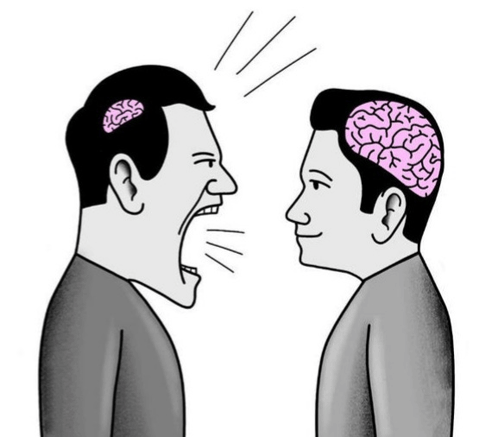
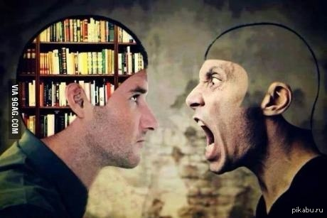
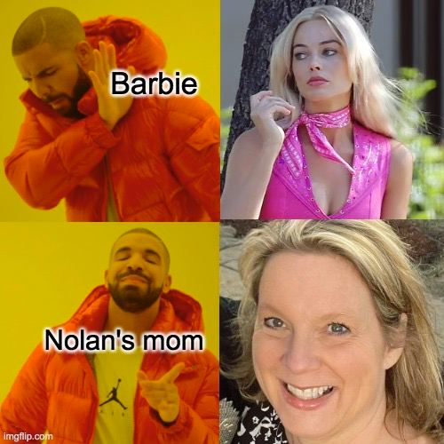
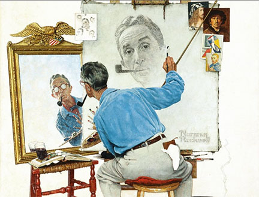

## Uhmm-Progtamming-language
...is a esoteric language, that is betr than c++ cuz better syntax!

--

--

# how to buid

uhmm just uuuhmmm addd dddd ddd d uhmm

just click build -> debug -> ummlang.exe

or

intal vscode
instal cpp
instal cmake
press main.cpp
press cntrl+shift+P
press cmake configue
press cntrl+shift+P
press c++ configue
press cntrl+shift+P
press cmake build
enable on terminal

to edit cod just edit file "code.uhm"

--

--

# MAIN

In c++ u dont know when the line ends and where it starts. UPL slove that problem!!
Instead of stupid ";" I added "and..." and "hmm" for every line start!
That more interesting and better than c++'s!!
In c++ you must write boring "int/void main()" to enter the code* but UPL sloves that one too!
You write **your own stream** that starts with **"uhmm hello everyone ts me coolgamer code and now ther i got it V%:"**
*(V% is sep)*

--

--

In the stupid c++ you must write "int a, b..." but that one is sloved by ME!!

in UPL you can write more cool type:
* swim as float
* numbr as int
* useless as double
* nolanmomstring as string ( NOLSTRING msg ENDNOLSTRING)
* trueornot as bool (umausume is true ronaldo is false)

--

--

In UPL instead of COUT you can js write "getting from my viewer" yo

--
.jpg)
--

and you can write to console with "i gonna show my obs"
yo
like
streamer

# CYCLES and IF-statements

in UPL cycles is a dementia:
* in UPL cycles is a dementia
* in UPL cycles is a dementia
* in UPL cycles is a dementia

* in UPL cycles is a dementia
* in UPL cycles is a dementia

and instead of if-else we got "yanderedev" with end "uhmm yanderedev blog end and..."
like yandere dev

...after all, the compiler is yandere's style too

and ends all of it with

## well thats it subscribe to the chanel!
